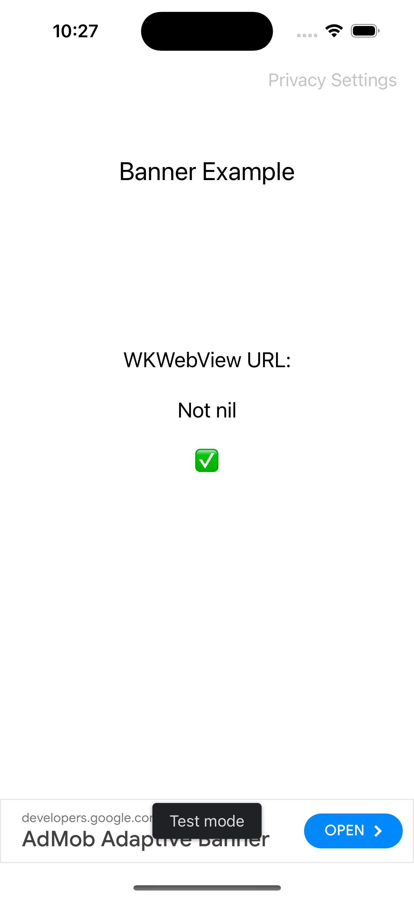

### Summary

AdMob banner ads are rendering blank when iOS "suspends" an app that has been in the background for some time. The blank ads appear to be caused when the banner view's underlying `WKWebView`'s `url` property becomes `nil`.

To reproduce this, run this sample app on a real device (iPhone) running iOS 17.4 (I am unsure if this issue is present on other iOS versions). Open the app, return to the Home Screen, and then let the app sit in the background from anywhere from 30 minutes to several hours (there is no way to trigger a "suspended" state). When returning to the app, sometimes the ad banner view will be blank, and the message shown should indicate the the URL is `nil`.

For more detail, see the links below.

### Links

* https://support.google.com/admob/thread/272825691/banner-ad-blank-when-app-returns-to-foreground-sometimes-ios?hl=en&authuser=1
* https://groups.google.com/u/1/g/google-admob-ads-sdk/c/rwBpqOUr8m8
* https://github.com/googleads/googleads-mobile-ios-examples/issues/421

-----

When the ad renders blank with a `nil` URL, the status will update to indicate this.

